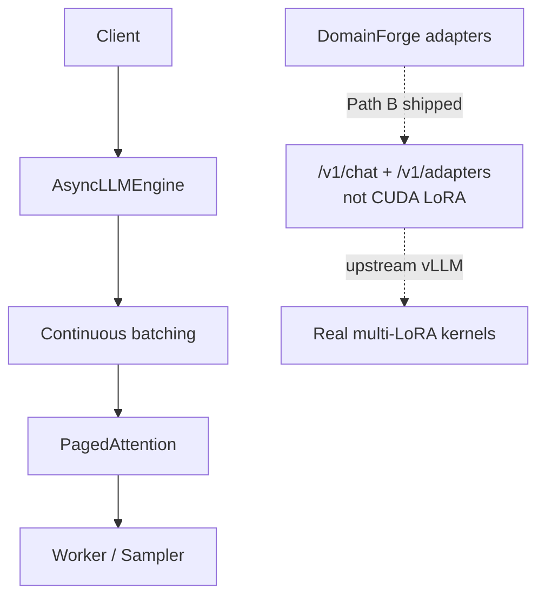

# vLLM Architecture Lab


<!-- vpeetla-tech-stack:start -->
[]() []() []() []() []()
<!-- vpeetla-tech-stack:end -->
## Agent skills (Cursor + Codex)

Org skills: [vpeetla-ai-skills](https://github.com/vpeetla-ai/vpeetla-ai-skills). This repo includes `.cursor/skills/`, `AGENTS.md`, and `CONTEXT.md`.

```bash
git clone https://github.com/vpeetla-ai/vpeetla-ai-skills.git
./vpeetla-ai-skills/scripts/install.sh --cursor --codex --project .
```

---

[](https://vllm-architecture-lab.vercel.app)
[](https://vllm-architecture-lab-api.onrender.com/health)
[](LICENSE)
[](https://github.com/vpeetla-ai)

I’d teach *why* vLLM wins on throughput before anyone copies a YAML. This lab is a pure-Python engine: PagedAttention blocks, continuous batching, KV budget math, glass-box replay — Teaching drawer for FDE / Principal interviews.

> Not a production vLLM fork. No CUDA. Upstream vLLM when you need real kernels.

[▶ Live demo](https://vllm-architecture-lab.vercel.app) · [API](https://vllm-architecture-lab-api.onrender.com/health) · [Architecture tabs](demo/index.html) · [venkat-ai.com/work](https://venkat-ai.com/work)

**Portfolio:** [Case study](https://github.com/vpeetla-ai/ai-architecture-portfolio/blob/main/case-studies/vllm-architecture-lab.md) · [Architecture](docs/ARCHITECTURE.md) · [ADR-022 Path B (educational multi-LoRA)](https://github.com/vpeetla-ai/ai-architecture-portfolio/blob/main/adr/ADR-022-domainforge-vllm-multi-lora-serving.md)

## Architecture

Canonical: [`docs/diagrams/canonical-architecture.mmd`](docs/diagrams/canonical-architecture.mmd)



## What you'll learn

| Concept | Implementation |
|---------|----------------|
| **PagedAttention** | `BlockSpaceManager` — logical → physical blocks, CoW prefix sharing |
| **Continuous batching** | `Scheduler` — waiting / running / swapped queues, per-step slot reuse |
| **Prefix cache** | Hash-based KV block reuse (60–80% hit in chat workloads) |
| **KV budget formula** | `compute_memory_budget()` — H100 + Llama-3 sizing |
| **AsyncLLMEngine** | `LLMEngine.step()` + async wrapper |
| **OpenAI API shape** | `POST /v1/completions` stub on educational simulator |

---

## 60-second architecture

```text
Client → FastAPI (/v1/completions, /v1/chat/completions, /v1/adapters, /api/simulate)
      → AsyncLLMEngine
      → Scheduler (FCFS, preemption, swap)
      → BlockSpaceManager (PagedAttention pages)
      → Worker/Sampler (stub — no CUDA required)
      → token stream (+ optional educational adapter swap)
```

Interactive explorer: **5 tabs** — Architecture · KV Cache · Batching · Memory · FDE Relevance.

---

## Quick start

```bash
python -m venv .venv
source .venv/bin/activate
pip install -e ".[dev]"

# CLI simulator
python -m vllm_lab --prompt "Explain continuous batching" --max-tokens 8

# KV budget calculator
python -m vllm_lab --budget

# API server
uvicorn backend.app.main:app --reload --port 8000

# Tests (no GPU, no API keys)
pytest -q
```

Open `demo/index.html` locally or deploy to Vercel. Set `demo/config.js` → `VLLM_LAB_API` to your Render API URL for live sim.

Glass-box default: architecture + live `/v1/ops/metrics` · engine-trace replay from real `steps[].trace` · simulator product. Event counts and steps only — I won’t invent wall-clock latency on a pure-Python engine.

---

## Implementation status

| Component | Status | Notes |
|-----------|--------|-------|
| BlockSpaceManager (paging) | **Implemented** | allocate, free, swap, CoW |
| Scheduler (3 queues) | **Implemented** | FCFS, preemption, continuous batch |
| Prefix cache | **Implemented** | hash lookup + stats |
| KV budget formulas | **Implemented** | Llama-3 8B/70B, AWQ, TP |
| LLMEngine step loop | **Implemented** | educational token stub |
| FastAPI + OpenAI stub | **Implemented** | `/v1/completions`, `/api/simulate` |
| Educational multi-LoRA Path B | **Implemented** | `/v1/chat/completions` + `/v1/adapters` (ADR-022 — not CUDA) |
| Glass-box workbench UX | **Implemented** | 3-column: architecture rail + live SLOs · honest engine-trace pipeline replay · simulator product |
| Ops / observability honesty | **Implemented** | `/health` + `/v1/ops/metrics` + `/v1/observability/status` — pure-Python engine; `p95` null; no CUDA |
| Interactive HTML explorer | **Implemented** | Architecture / KV / Batching / Memory / FDE tabs |
| PagedAttention CUDA kernel | **Conceptual** | documented, not implemented |
| FlashAttention / real model | **Conceptual** | use upstream vLLM for prod |
| Tensor parallel / Ray | **Conceptual** | topology in Memory tab |
| Speculative decoding | **Conceptual** | batching tab explains mechanics |

---

## API endpoints

| Endpoint | Purpose |
|----------|---------|
| `GET /health` | Health + honesty flags (`engine`, `wall_clock_latency`, `gpu_backed`) |
| `GET /v1/ops/metrics` | Queue/KV snapshot; `p95_latency_ms` always null |
| `GET /v1/observability/status` | Trace + ops exporter planes; Path B / no CUDA |
| `POST /api/simulate` | Run full request through engine, return step trace |
| `POST /api/step` | Single `step()` call |
| `GET /api/snapshot` | KV blocks + queue state |
| `POST /api/memory/budget` | GPU KV budget calculator |
| `POST /v1/completions` | OpenAI-compatible stub |
| `POST /v1/chat/completions` | Educational chat + optional `lora` adapter id (Path B) |
| `GET/POST /v1/adapters` | Register/list educational LoRA adapters |

---

## Deploy

| Layer | Host | URL |
|-------|------|-----|
| UI | Vercel | https://vllm-architecture-lab.vercel.app |
| API | Render | https://vllm-architecture-lab-api.onrender.com — cold start ~30s on free tier |

> **First-run note:** The Render API sleeps after inactivity on the free tier. The first request after idle takes ~30s to wake; the UI simulator runs client-side and works without the API.

[](https://render.com/deploy?repo=https://github.com/vpeetla-ai/vllm-architecture-lab)

See [docs/DEPLOY.md](docs/DEPLOY.md) for full steps.

---

## Repo layout

```text
src/vllm_lab/
  kv_cache/       # BlockSpaceManager, PrefixCache, formulas
  scheduler/      # FCFS continuous batching
  engine/         # LLMEngine, AsyncLLMEngine
  sampling/       # top-p, top-k, temperature
backend/app/      # FastAPI
demo/             # Interactive architecture HTML
tests/            # pytest (deterministic, no GPU)
docs/ARCHITECTURE.md
```

---

## Interview map

**Business function:** Educational LLM serving lab — PagedAttention, continuous batching, KV-cache economics.

Staff+ prep crosswalk — [playbook](https://github.com/vpeetla-ai/ai-architect-interview-playbook) · [study UI](https://ai-architect-interview-playbook.vercel.app) · [Practice Arena](https://ai-architect-practice-arena.vercel.app) · [org matrix](https://github.com/vpeetla-ai/ai-architecture-portfolio/blob/main/docs/REPO_INTERVIEW_MAP.md). Only entries this repo honestly exercises.

| Category | Entry | Fit |
|----------|-------|-----|
| System design | [LLM inference serving at scale](https://ai-architect-interview-playbook.vercel.app/q/ai-system-design/01-llm-inference-serving-at-scale/) ([md](https://github.com/vpeetla-ai/ai-architect-interview-playbook/blob/main/ai-system-design/01-llm-inference-serving-at-scale.md)) | Primary map — paging, batching, KV |
| Cloud | [GPU capacity planning](https://ai-architect-interview-playbook.vercel.app/q/cloud-architecture/01-gpu-capacity-planning-and-procurement/) ([md](https://github.com/vpeetla-ai/ai-architect-interview-playbook/blob/main/cloud-architecture/01-gpu-capacity-planning-and-procurement.md)) | Partial — capacity framing for serving fleets |
| Cloud | [Orchestration & cost optimization](https://ai-architect-interview-playbook.vercel.app/q/cloud-architecture/06-container-orchestration-and-cost-optimization-at-scale/) ([md](https://github.com/vpeetla-ai/ai-architect-interview-playbook/blob/main/cloud-architecture/06-container-orchestration-and-cost-optimization-at-scale.md)) | Partial — serving cost / utilization story |
| Trade-offs | [Build vs train vs fine-tune](https://ai-architect-interview-playbook.vercel.app/q/scalability-governance-tradeoffs/04-build-vs-train-vs-finetune-foundation-model-strategy/) ([md](https://github.com/vpeetla-ai/ai-architect-interview-playbook/blob/main/scalability-governance-tradeoffs/04-build-vs-train-vs-finetune-foundation-model-strategy.md)) | Partial — multi-LoRA serving economics (ADR-022) |

## Connect

- Part of [vpeetla-ai](https://github.com/vpeetla-ai) reference stack
- Essay: [From Multi-Agent OS to Agent Governance](https://github.com/vpeetla-ai/ai-architecture-portfolio/blob/main/case-studies/from-multi-agent-os-to-agent-governance.md)
- Production inference: use [vLLM](https://github.com/vllm-project/vllm) upstream

MIT License
