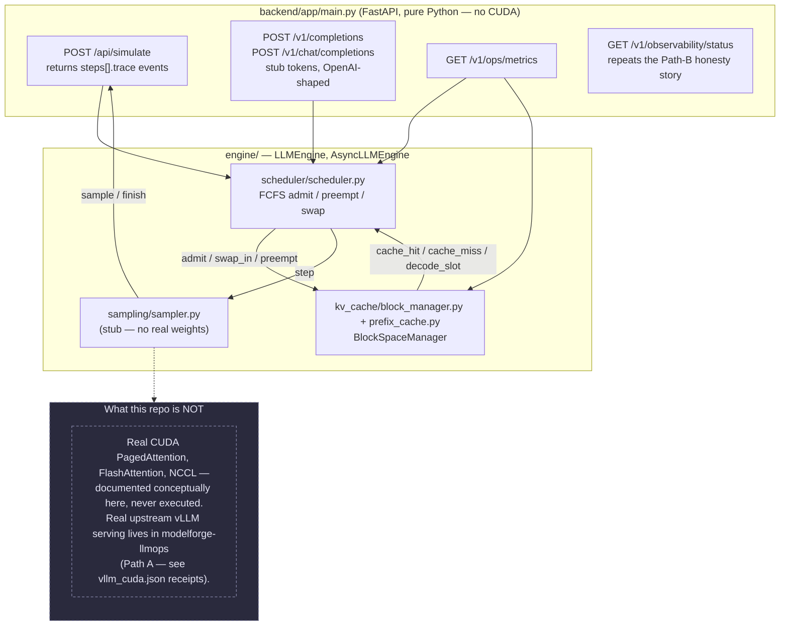
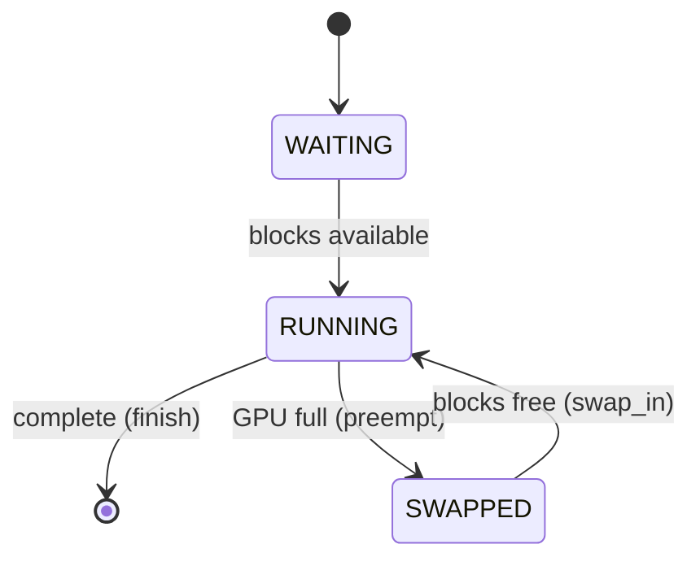

# Architecture — vLLM Architecture Lab

## Purpose

I’d put this in front of an FDE candidate who can recite “PagedAttention” but can’t size a KV budget. Educational reference for vLLM’s high-throughput design — maps 1:1 to the demo tabs. Teaching drawer, not a production fork.

## Diagram



**Scheduler state machine:**



## Layer map

| Layer | vLLM component | This repo |
|-------|----------------|-----------|
| API | FastAPI, OpenAI routes, SSE streaming | `backend/app/main.py` |
| Engine | `LLMEngine`, `AsyncLLMEngine` | `engine/llm_engine.py`, `async_engine.py` |
| Scheduler | FCFS, preemption, swap | `scheduler/scheduler.py` |
| KV cache | `BlockSpaceManager`, prefix cache | `kv_cache/block_manager.py` |
| Batching | Continuous batching, token budget | scheduler + config knobs |
| Model exec | PagedAttention CUDA, FlashAttn, sampler | sampler stub; CUDA documented only |

## Key design decisions

### ADR-001: Simulator, not fork

We implement **scheduling and memory semantics** in pure Python without CUDA. This keeps CI fast and makes queue/block state inspectable via API — appropriate for interview prep and architecture teaching.

### ADR-002: Honest status boundaries

CUDA kernels, real weight loading, and NCCL are **documented conceptually** in the HTML explorer. Production uses upstream vLLM. `GET /v1/observability/status` repeats the same story: pure-Python engine, `p95` null, Path B is educational.

### ADR-003: OpenAI-compatible API shape

`POST /v1/completions` returns stub tokens so integrators (AegisAI gateway, content factory) can test routing without GPU.

### ADR-004: Glass-box demo honesty

The default **Glass-box** tab is a three-column workbench (architecture rail + live `/v1/ops/metrics` · engine-trace pipeline replay · simulator product). The center pipeline replays a five-phase serving path — Schedule → KV cache → Decode → Sample → Finish — by mapping the **real `steps[].trace` events** returned by `POST /api/simulate` (`admit`/`swap_in`/`preempt` → schedule, `cache_hit`/`cache_miss`/`decode_slot` → KV, `step` → decode, `sample` → sample, `finish` → finish). It surfaces event counts, engine steps, tokens, and queue depth only. It deliberately shows **no wall-clock latency** and labels `gpu_utilization_pct` as a scheduler heuristic (`35 + running×12`), because this is a pure-Python teaching engine, not a GPU-backed server.

## KV cache formula

```text
kv_per_token = 2 × num_heads × head_dim × dtype_bytes × num_layers
num_blocks = (gpu_mem × util − weights) / (block_size × kv_per_token)
```

See `kv_cache/formulas.py`. (Scheduler state machine diagram is above, under "Diagram".)

## Integration with vpeetla-ai stack

| Use case | Integration |
|----------|-------------|
| AegisAI gateway | Route `/v1/completions` through policy + HITL |
| LoopForge | Tune `max_num_seqs`, `gpu_memory_utilization` via harness |
| Portfolio | Case study + live demo for FDE interviews |

## References

- [vLLM paper — PagedAttention](https://arxiv.org/abs/2309.06150)
- Interactive demo: `demo/index.html`
